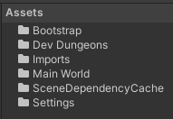

# Free Parking – Setup

Welcome! We are so excited to see what you create, no matter how big or small!

If you are already familiar with forking a Unity project, you can skip to here.

## Forking the Project

Todo

## Opening the Project

Todo

## The Project Assets

The Assets folder contains only a small number of base directories.

Bootstrap contains the title, main menu, and credits scenes, along with the base
code that ties the whole project together. You will need to enter this directory
when entering your name into the credits. But otherwise you likely won’t need to
touch anything in here.

Dev Dungeons contains all the scenes, code, prefabs, created assets, and other
resources used by the dev dungeons. The Dev Dungeons are grouped by author name
and then by dungeon. If you plan to create your own dev dungeon, you will work
mostly in here.

Imports contains all imported assets from external sources (assets that were
downloaded from the internet or created in a third-party tool). If you plan to
add new assets to the project that aren’t created directly in the Unity Editor,
you will need to add them in here.

Main World contains the scene and code that drives the core gameplay experience.
If you want to help populate the world, simply open the Main World Scene and
start editing.

## Playing the Game

Todo

## Adding Your Own Touch

The fun is just getting started. Check out one of these guides to see how to
contribute:

-   [Importing Assets](Importing%20Assets.md)
-   Decorating the Scene – Todo
-   [Creating a Dev Dungeon](Creating%20a%20Dev%20Dungeon%20Manually.md)
-   Creating Activities - Todo
