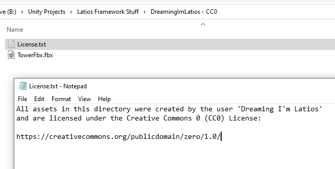

# Importing Assets

You have some amazing asset you want to totally add to the world or your dev
dungeon? Cool. There are a few checks we need to go through.

## Are the assets appropriate?

Reminder: NSFW and highly offensive content are prohibited. That doesn’t mean
everything needs to be super squeaky clean and family friendly. Overall, we’ll
try to be tolerant and understanding. And if you are ever unsure, just ask! We
reserve discretion in enforcing this rule.

## Are the assets legal?

AI-generated assets carry a lot of legal uncertainty. While AI-generated content
may be legal today, the technology is new enough where that may change in the
future. For this reason, AI-generated content is currently disallowed so that
Free Parking can continue to thrive as the rules around AI evolve.

Additionally, most assets are subjected to some form of copyright license. Some
of these can be legally used in Free Parking, while others cannot.

There is an exception for AI assets made with Unity muse. Such assets are
permitted.

### Good licenses

Assets licensed under CC0 or “Public Domain” are awesome! They carry no
restrictions to their use.

There are many other Creative Commons licenses and other free licenses that are
permissible. The main two things for Free Parking are that they must be
distributable in source form, and must allow derivatives.

### Bad licenses

One kind of problematic license is a license the prevents derivative works. This
disallows users in Free Parking from making a copy and modifying the asset to
suit their goals. Because of this, licenses of this nature are disallowed.
Licenses with this restriction often take the form of Creative Commons licenses
with the ND modifier (No Derivatives).

Another common but problematic license is a license that prevents distribution
in source form. This is often the case when the same license is used for both
free and paid assets. Because any free asset could have its price changed by the
author at a later time, it is not legal to distribute these assets in a public
GitHub project. Examples of such licenses include:

-   The Unity Asset Store EULA
-   TurboSquid Standard License

However, such assets may additionally be authored under an additional license,
such as a Creative Commons license. In such cases, it is up to the licensee
(Free Parking) to choose the license to be governed by. Most free Unity Asset
Store publishers aren’t aware of this caveat, so if you really want to use a
Unity Asset Store asset, reach out to the publisher to see if they are willing
to provide an alternate license.

## Are the assets packaged correctly?

All assets from the same source should be contained within a single parent
directory. A license file of some sort providing the necessary license
information (such as the type of license and optionally links to the download
source).

If you created the assets, you must add your own License.txt file which
specifies the license for those assets.

## Did Unity import the assets correctly?

Add the directory with your assets into the Imports folder of the Free Parking
project. Then check that Unity imported the assets correctly. Change import
settings as needed. Be wary of 90-degree rotations of models. Refer to this
guide for models created in Blender:

<https://polynook.com/learn/how-to-export-models-from-blender-to-unity>

## Are your characters deformation-ready?

Kinemation requires all skinned mesh materials use special shaders for
deformations to work. Such shaders can be created with Shader Graph. You can
find such shaders in *Imports -\> \_Latios Shader Graphs*. If you do not find an
appropriate shader there for your model, feel free to create one in that
directory.

## Did you add your name to the credits?

If you made it this far, you are almost done. Go into the Bootstraps folder of
the Free Parking and open Credits.md in a text editor. Add your name under the
*Imports* heading, leaving blank lines before and after.

Don’t be shy! You deserve to be on that list!

## Did you make a Pull Request?

The very last step is to commit your changes and make a Pull Request on GitHub.
We may request some concerns be addressed before allowing the assets to be let
into the official version that other users see. But once the pull request is
merged, it is in and the assets are available for everyone to use. Success!

That ends this guide. If you have any questions about the process, don’t
hesitate to ask!

## Imports not up to snuff?

Not all existing imports have reached their full potential. Materials may lack
PBR properties, or characters may lack appropriate shaders. Feel free to make
them better and document your changes in your Pull Request!
